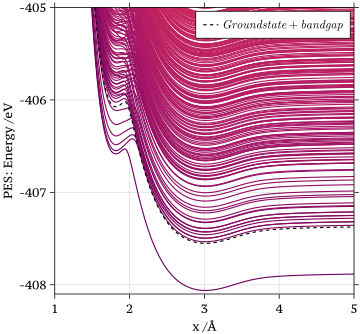
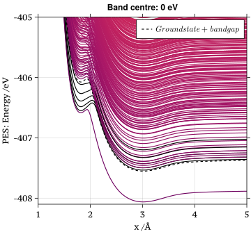
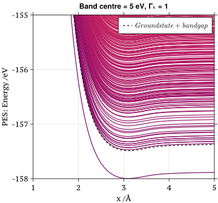
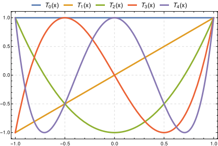

# Hydrogen with A Electron Already 

This note is to record the ideas after the regular Friday meeting with Reini on $3^{\text{rd}}$ May 2024. [Xuexun](https://louhokseson.github.io) remains all the copyright© of this script.

In the previous [note](3-MAY-2024.html), we have discussed that how adiabatic PES are calculated and raise a question at the end why does the eigenvalue of absorbate occur under the Fermi energy? **It turns out that those accumulation states where charged impurity state $h(x)$​ becomes a part of the valence band.**

To address the "黐線 ci-sin" phenomenon at the tail of the adiabatic PES plot, where the absorbate state is situated in the valence band, we opt to artificially introduce a pre-existing electron to hydrogen.

In this scenario, our attention shifts to the tail region characterized by a small coupling effect, signifying that $h(x)$​​ is the eigenstate of the absorbate. By setting the ground state occpuational vector as
$$
\begin{align}
|1,\cdots, \textcolor{red}{1},\cdots, 1 ,1 ,1,\textcolor{green}{1}, \textcolor{blue}{0},0,0\cdots,0 \rangle \tag{Ground}
\end{align}
$$
where the impurity state is occupied as the highlighted as 1. Giving a extra electron in the system is equivalent of eliminating those accumulation states I mentioned in last [note](3-MAY-2024.html).


.svg)



### Configurational Vector

This vector is not the second quantisation vector. It is just the index of these **sorted set of eigenvalues at $x = 5\text{\AA}$.** from the electronic Hamiltonian matrix. 1 stands for that state is occupied and 0 is not. In our model, the absorbate state generally shifts above when it gets closer to the surfaces. **Then, considering $51^{\text{st}}$ slot as impurity is definitely incorrect.**  So those analysis I made in [$3^{\text{rd}}$ May 2024](3-MAY-2024.html) should be interperted in a different way. Simply because $51^{\text{st}}$ can / most likely be the highest valence state. In this sense, this configurational vector does not have any physical meanings in the system. It is just a artifical indexing vector for summation of those sorted eigenvalues. 

Just bear in mind that **Each PES / curve does not only represent a unique state in terms of charges of the system**. We will investigate it as below. 

```julia
# h(x) in eV at the last grid point x = 5Å
auconvert(u"eV",diag(potential.(model, matrix_x)[end])[1]) 
    -4.855111300652138 eV

#  h(x) in eV at the first x = 2Å grid point
auconvert(u"eV",diag(potential.(model, matrix_x)[50])[1])
    0.30486988682545796 eV
```

When $x = 2\text{\AA}$, the value of $h(x)$ is higher than the Fermi level 0 eV. Although, we have some siginificant non-diagonal coupling parts $A_1, \cdots, A_{100}$ in the electronic Hamiltonian matrix. 0.304 eV suggests that impurity state is in the conduction band. Also, we could check it explicitly in Julia

```julia
bandgap = 0.51

auconvert(u"eV",eigs[50][50])
-0.2671483157043161 eV
auconvert(u"eV",eigs[50][51])
0.12863908150602665 eV
auconvert(u"eV",eigs[50][52])
0.27038304593373097 eV
length(eigs[50])
101
# check the gap
auconvert(u"eV",diag(potential.(model, matrix_x)[50])[51])
-0.26392423120299097 eV
auconvert(u"eV",diag(potential.(model, matrix_x)[50])[52])
0.26392423120299097 eV
```

It shows that at $x = 2\text{\AA}$ there are 50 states with energy smaller than 0 and 51 above which indicates the absorbate is in conduction band. Now it indicates that the groundstate
$$
\begin{align}
|1,\cdots,1 ,1 ,\textcolor{green}{1},\textcolor{blue}{1},0, \cdots ,\textcolor{red}{0},\cdots, 0,0 \rangle. \tag{Ground}
\end{align}
$$
The blue-highlighted 1 is the lowest state in conduction band. And red one is the absorbate slot. The green $\textcolor{green}{1}$ and the blue $\textcolor{blue}{1}$ are forming a 0.51 eV gap in between. The first excited state at $2\text{\AA}$ is
$$
\begin{align}
|1,\cdots,1 ,1 ,\textcolor{green}{1},\textcolor{blue}{0},1, \cdots ,\textcolor{red}{0},\cdots, 0,0 \rangle. \tag{$1^{\text{st}}$}
\end{align}
$$
Now, it matches the fact from the graph because the distance of the first and the second are smaller than the band gap. "黐線 ci-sin" phenomenon occurs when $x<2\text{\AA}$.

In short, the ground state starts with charged impurity initially. When it gets closer to surface, the impurity becomes uncharged.


### 黐線 "ci-sin" Phenomenon on the Left



The band gap shift a slot to the left in the configuration vector while the impurity moves closer to the surface. We can simply explain the black highlighted states by looking at their corresponding configuration vectors

```bash
julia> @info configurations[1][48:60]
[ Info: [1.0, 1.0, 1.0, 1.0, 0.0, 0.0, 0.0, 0.0, 0.0, 0.0, 0.0, 0.0, 0.0]
# 1st black curve
julia> @info configurations[2][48:60]
[ Info: [1.0, 1.0, 1.0, 0.0, 1.0, 0.0, 0.0, 0.0, 0.0, 0.0, 0.0, 0.0, 0.0]
# 2nd black curve
julia> @info configurations[4][48:60]
[ Info: [1.0, 1.0, 1.0, 0.0, 0.0, 1.0, 0.0, 0.0, 0.0, 0.0, 0.0, 0.0, 0.0]
# 3rd black curve
julia> @info configurations[7][48:60]
[ Info: [1.0, 1.0, 1.0, 0.0, 0.0, 0.0, 1.0, 0.0, 0.0, 0.0, 0.0, 0.0, 0.0]
# 4th black curve
julia> @info configurations[10][48:60]
[ Info: [1.0, 1.0, 1.0, 0.0, 0.0, 0.0, 0.0, 1.0, 0.0, 0.0, 0.0, 0.0, 0.0]
# 5th black curve
julia> @info configurations[14][48:60]
[ Info: [1.0, 1.0, 1.0, 0.0, 0.0, 0.0, 0.0, 0.0, 1.0, 0.0, 0.0, 0.0, 0.0]
```

If we compare these to the $(1^{\text{st}})$ excited state above, you will find that they share a thing in common which is the green slot is 1 and blue slot is 0. That means that These black highlighted PESs do not have a second electron to jump over the band gap. **What they representing againt ground state is pushing the only electron in the conduction band a little higher (this push is smaller than the width of the band gap).** So, these states can be also considered as accumulation states at $x = 2\text{\AA}$.

### Shift the Band Center

 Together with the discussion above, with the current ErpenbeckThoss' $h(x)$​​, the eigenvalue of absorbate will under the Fermi level. So with a charged impurity state, the first excited state is exactly a bandgap above the ground state.

Knowing the fact that the given ErpenbeckThoss $h(x)$, if we **shifted the whole band up for 5 eV as well as the Fermi level**, the system with a charged impurity will have adiabatic PES as below. 终于搞出这个图了！！！




# Density of States

The most basic property of *density of states* is 
$$
\int \rho_{\text{DOS}}(\epsilon) \mathrm{d} \epsilon = N
$$
where $N$ stands for the number of states in our space. Just simply consider the energies are discretized as $\{\epsilon_1,\cdots,\epsilon_N\}$, we should find
$$
\begin{align}
\int \rho_{\text{DOS}}(\epsilon) \mathrm{d} \epsilon = N = \sum_k^{N}\int \delta(\epsilon - \epsilon_k) \mathrm{d} \epsilon
\end{align}
$$
with the fact that
$$
\int \delta(\epsilon - \epsilon_k) \mathrm{d} \epsilon = 1 \quad \text{for all }k
$$
By implying a stronger equality than (1), the definition of DOS is  
$$
\begin{align}
\rho_{\text{DOS}}(\epsilon) := \sum_k \delta(\epsilon - \epsilon_k).\tag{DOS}
\end{align}
$$
Just remind that $\rho_{\text{DOS}}$​ is defined as (DOS). Knowing (1) does not imply to (DOS). But (DOS) implies to (1).

### Whole System's DOS

To investigate further of the scattering system, plotting the DOS of the total system(including the coupling effects and impurity).

**Before Plotting**

- The DOS should change when the distance $x$​ varies.
- Keep a certain hybridisation scale $\Gamma_{k}$ and number of states fixed.

# Clarification Needed

Newns-Anderson Hamiltonian is exactly solvable which means we have a explicit representation of the states in the system.

A question rasies from making this adiabatic PESs computation: 

*By setting up the corresponding NAH matrix and solving its eigenvalues, we will surely get a banch of numbers representing the energy states in the system. However, it seems to be contradicting to the fact that states in the system follow the Cauchy distribution. Because by the definition of the Cauchy distribution, we don't have the cetain mean of it.*

Hokseon's answer:

Diagonalising the electronic Hamiltonian implies that we are working under the adiabatic assumption. However, the Cauchy distribution is based on non-adiabatic dynamics. So, we couldn't link this PDF to the eigenvalue we compute. 

In a more analytical perspective: Diagonalisation of the matrix:
$$
\begin{align}
    H_{\text{el}}(x) = 
\begin{pmatrix}
h & A_{1} & A_{2} & \cdots & A_{n} \\
A_{1} & \epsilon_1 & 0 & \cdots & 0 \\
A_{2} & 0 & \epsilon_2 & \cdots & 0 \\
\vdots & \vdots & \vdots & \ddots & \vdots \\
A_{n} & 0 & 0 & \cdots & \epsilon_n \\
\end{pmatrix}. \label{eq:Hamiltonian-matrix-NA}
\end{align}
$$
certainly results a unqiue set of the eigenvalues and eigenvectors no matter $A_1 \cdots A_n$​ are nonzero or not. The certainty generates from the nonadiabatic dynamics.

So, I think when we are thinking of the reparameterisation of the molercular potenitals, as long as we are looking at an adiabatic picture, we shouldn't relate the states into a broaden way. 


Reini's Answer:

The broadening occurs from the Green's function (Lorentzian / Cauchy Distribution) perspective of a state which corresponds to a unique static eigenvalue. 

On the basis of the Reini's Answer, Xuexun's thoughts:

The state under the effect from the hybridisation would broaden. It can be understood as it becomes a wave like function. 

# Something Can Be Done Next

- If I remember correctly, [Chebyshev polynomials](https://en.wikipedia.org/wiki/Chebyshev_polynomials) was introduced in Best Approximation (fitting a polynomial with dots in terms of infinity norm). Maybe we can try those roots of the Chebyshev polynomials and against the results of Gauss-Legendre. The Numerical Analysis and Theory recommended books can be found [here](https://www.maths.dur.ac.uk/users/anthony.yeates/at/books.html).

- Gapped for TrapezoidalRule(expand it) 
