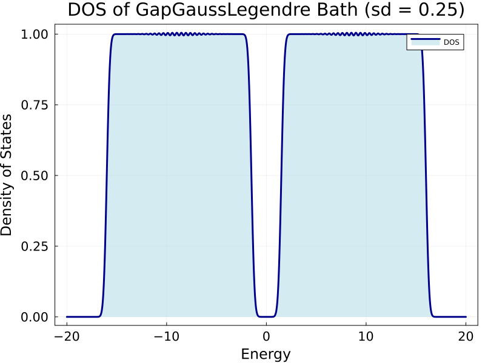
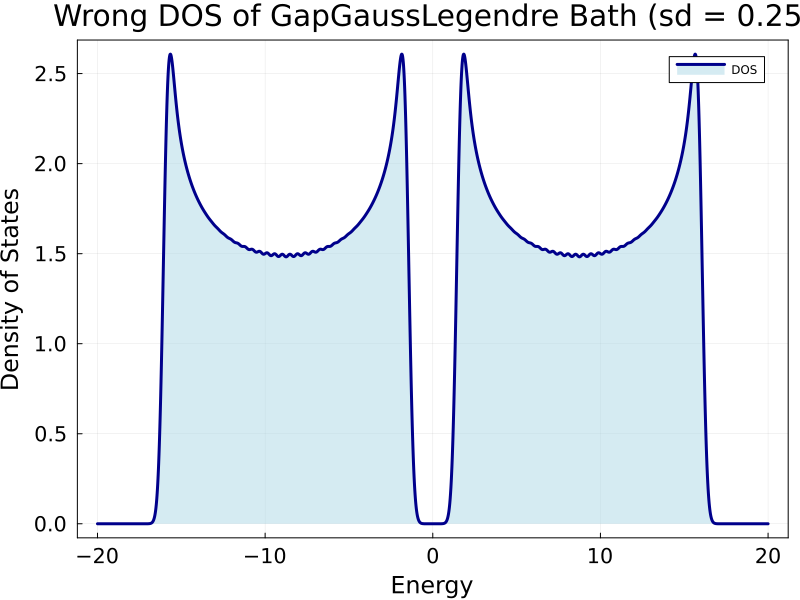
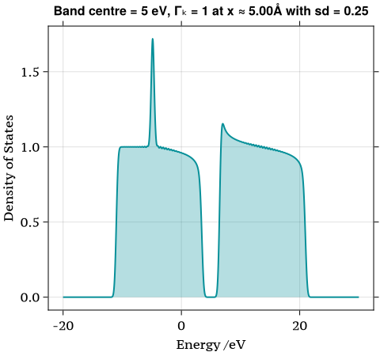
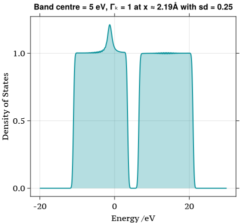

# GapGaussLegendre DOS Fixed

Finally, I fixed the weird none flat Gapped DOS. Bangap = 3 eV 



It was something like 



The bathcoupling factors comes from the Gauss-Legendre quadratures' weights $\alpha_i$ which are fixed values when have a certain number of the knots $x_i \in [-1,1]$. 

In the gapped model, we have two bands. i.e. Valence band and Conduction band. The weights can be linearly transformated into a more general representation $\tilde{\alpha}_i$.
$$
\tilde{\alpha}_i = \frac{\text{length of band}}{2} \cdot \alpha_i
$$

- Length of band: length of the valence band or conduction band.
- $\dfrac{\cdot}{2}$ : $x_i$ are sampled from $[-1,1]$​​ already with length 2. Dividing by 2 is normalisation from the Legendre polynomial's roots.

New implementation in [NQCModels.jl](https://github.com/maurergroup/NQCModels.jl/tree/hokseson) of GapGaussLegendre

```julia
knots, weights = gausslegendre(div(M, 2))
ΔE = bandmax - bandmin
bandlengths = (ΔE - gapwidth)/2
.
.
.
# coupling is the sqrt() of the weights times the bandlengths/2 [valence band's coupling ; conduction band's coupling]
bathcoupling = [sqrt.(weights.*bandlengths/2); sqrt.(weights.*bandlengths/2)]

```

Just make the code a bit more concise and simple. The details of plotting the correct DOS can be viewed at [here](https://github.com/maurergroup/NQCModels.jl/blob/hokseson/plots/GapDOS.jl).

**Does this implementation correct? Especially on the scaling factor bandlengths/2**

# Density of State in Newns-Anderson Model

The most basic property of *density of states* is 
$$
\int \rho_{\text{DOS}}(\epsilon) \mathrm{d} \epsilon = N
$$
where $N$ stands for the number of states in our space. Just simply consider the energies are discretized as $\{\epsilon_1,\cdots,\epsilon_N\}$, we should find
$$
\begin{align}
\int \rho_{\text{DOS}}(\epsilon) \mathrm{d} \epsilon = N = \sum_k^{N}\int \delta(\epsilon - \epsilon_k) \mathrm{d} \epsilon
\end{align}
$$
with the fact that
$$
\int \delta(\epsilon - \epsilon_k) \mathrm{d} \epsilon = 1 \quad \text{for all }k
$$
By implying a stronger equality than (1), the definition of DOS is  
$$
\begin{align}
\rho_{\text{DOS}}(\epsilon) := \sum_k \delta(\epsilon - \epsilon_k).\tag{DOS}
\end{align}
$$
Just remind that $\rho_{\text{DOS}}$​​ is defined as (DOS). Knowing (1) does not imply to (DOS). But (DOS) implies to (1).


# DOS of the Electronic Hamiltonian

The squared first element of the eigenvector produces a bit weird result. Instead, I think the impurity should not distort the bath's DOS that much. So, why don't we keep using the bathcoupling as the scaling scalars to plot the DOS?

First try (I assume it does not work): By adding the last coupling element to tail again, we would obtain a new coupling array with `nstates + 1` length which should match to the number of eigenvalues in our Hamiltonian. And it's easy to implement by

```julia
Coupling_y = ustrip.(auconvert.(u"eV",[model.bath.bathcoupling;model.bath.bathcoupling[end]].^2))
```

The DOS of the total system is gonna be



The density generally have the same structure with the GapGaussLedengre DOS. Noticeably, a pike occurs around -5 eV which is the value of $h(x = 5 \text{\AA}) = - 4.85 \text{ eV}$.  So, this pike represents the impurity. Another abnormal thing in this plot is that the border of valence band and the band gap does not form a sharpe shoulder as it is at its left shoulder. That's because valence band now have an extra state from the impurity. It leads to a misalignment of those states on the right-hand side of the impurity.

**Hokseon's thought**: 

- We could try to find the index of the impurity's eigenvalues. Then inserting a scaling value into the coupling array  at impurity's slot. The value of the insertation can be set as the value adjacent to it. In other words, we just repeat the coupling factor at the impurity's slot in the array. ($\textcolor{red}{\text{Implemented}}$)
- When absorbate is far from the surface, the $h(x)$ should almost equal to the impurity's eigenvalues because Hamiltonian is almost approximating to the diagonal matrix. So if we assume that the $h(x)$ can always indicate the location of impurity state, this method should give a roughly correct DOS. ($\textcolor{red}{\text{Implemented}}$)
- The inserted value can be given as the polynomial that fitted with the coulpling vs Gauss Legendre points (Need Discussion)



### Animation of the DOS

Hokseson made an animation of the electronic Hamiltonian with band centre at 5 eV. This DOS was scaled by the method mentioned above. The animation code can be found [here](https://github.com/maurergroup/NQCD-IESH-Hokseson/blob/master/scripts/h(x)/Animation.jl).

<video src="fig/17-May-2024/Animation_DOS_centre=5.mp4"></video>

This animation is generated by projected density of states $\rho_\text{projected}$:
$$
\begin{align}
\rho_\text{projected} = \sum_i |\langle \phi_i| \phi_\text{projected}\rangle|^2 \delta(\epsilon - \epsilon_i). \tag{PDOS}
\end{align}
$$
The basic idea is projecting a function to one of its eigenstates $\phi_{\text{projected}}$. Any wavefunction can be represented by a linear combination of its eigenstates which we call it as superposition.
$$
|\Phi\rangle = a_1|\phi_i\rangle + a_2|\phi_2\rangle + \cdots + a_n|\phi_n\rangle
$$
where $a_i^2$ is the probability that $|\Phi\rangle$ occurs in state $|\phi_i\rangle$. Also, $|\phi_\text{projected}\rangle \in \{|\phi_i\rangle\}$. When we want to project $|\Phi\rangle$ onto a eigenstate, it can be simply done by 
$$
\langle \phi_{\text{projected}}|\Phi\rangle = \sum_i \langle\phi_{\text{projected}}| \phi_i\rangle a_i = a_{\text{projected}}
$$
This comes from the fact that our Hamiltonian is symmetric resulting the orthonormal eigenstates. Apart from wavefunction, density of states is an another way to describe a quantum system. It relates to probability from its name "density" which is the square of the wavefunction. In terms of the projection in density of states, we basically square the wavefunction and replace the $a^{2}_{\text{projected}}$ with $\delta(\epsilon - \epsilon_i)$ from $|\Phi\rangle$ and obtain (PDOS).

In our implementation, this projection can be done by setting the scaling factors of the Gaussian functions

``` julia
 Coupling_y = ustrip(auconvert.(u"eV", evecs[knot][1,:])).^2
 # Evaluate each Gaussian distribution at each x value and sum the results
 y = sum([pdf.(Distribution_y[i], x) .* Coupling_y[i] for i in eachindex(Distribution_y)]) 
 
```

If I understood it correctly,  `Coupling_y[i]` should be the $|\langle\phi_{\text{projected}}| \phi_i\rangle|^2$. By setting it as `evecs[knot][1,:]`, I assume we are treating the eigenvector of the impurity as 
$$
\langle\phi_{\text{projected}}| = [1,0,0,\cdots,0].
$$
Then we will have 
$$
|\langle\phi_{\text{projected}}| \phi_i\rangle|^2 = |[1,0,0,\cdots,0] * |\phi_i\rangle|^2
$$
that matches `ustrip(auconvert.(u"eV", evecs[knot][1,:])).^2`.


**Hokseon's Concern**

The electronic Hamiltonian indeed put the $h(x)$ on the first row and column
$$
\begin{align}
    H_{\text{el}}(x) = 
\begin{pmatrix}
h & A_{1} & A_{2} & \cdots & A_{n} \\
A_{1} & \epsilon_1 & 0 & \cdots & 0 \\
A_{2} & 0 & \epsilon_2 & \cdots & 0 \\
\vdots & \vdots & \vdots & \ddots & \vdots \\
A_{n} & 0 & 0 & \cdots & \epsilon_n \\
\end{pmatrix}. \tag{H}
\end{align}
$$
But I guess it won't true that $[1,0,0,\cdots,0]$ will be its eigenvector all the time right? Did I misunderstand in some parts of the equation.
