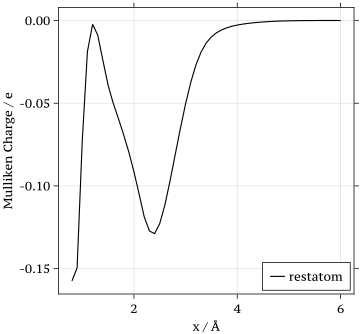
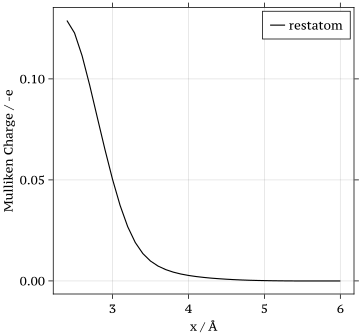

# Fit the Hokseon Model with Optimization.jl


On Friday June 14, Hokseon had a meeting with Reini about Hokseon's fitted model. Reini suggested hokseon using Optimization.jl to make the model's calculated charges and Eigen-composited NAH with the given DFT PES and Mulliken charges from Nils.


Check [Zygote](https://fluxml.ai/Zygote.jl/dev/adjoints/) and this ()

## General Thoughts

### Build the Loss function

**DFT Part**

In discrete form:
$$
L_{\text{DFT}} = \sum_i||\text{EGV}(x_i) - \text{DFT}(x_i)||^2
$$
where 
$$
\text{DFT}(x_i)=\text{PolynomialFit}(x_i) + c_{\text{align}},
$$

$$
\text{EGV}(x) = \text{smallest eigenvalue of } H(x)
$$

and 
$$
H(x) = \begin{bmatrix}
U_0(x) & V(x)\\
V(x) & U_0(x)+h(x)
\end{bmatrix}.
$$
Here, we should align fitted polynomial with the actual adiabatic ground state
$$
\text{PolynomialFit}(5 \text{\AA}) + c_{\text{align}} = \text{EGV}(5 \text{\AA})
$$
Just clarify a bit more $\text{DFT}(x_i)$ only has one parameter that can be trained that is $c_{\text{align}}$.

Concerns from Hokseon: I think $L_{\text{DFT}}$ already could take care of this alignment issue by adding $c_{\text{align}}$ as a parameter.

**Mulliken Charges Part**

The original charges population data is given as 



The peak occurs around $1 \text{\AA}$ is questionable. So, I adjusted it a bit into 



```julia
# Read the data from the file
data_Mulliken = readdlm(file_path)

startswith = 17

x = data_Mulliken[startswith:end, 3]

# align the DFT to the adiabatic ground state PES
charge =  - data_Mulliken[startswith:end, 4]

@info "using the last $(length(x)) points of Mulliken charges data"
```

Now it looks more like a step function which should be match to our Mulliken charges integration.
$$
L_{\text{charges}} = \sum_{i=1}^{37}||\text{Integration}(x_i) - \text{Mulliken}(x_i)||^2
$$
where 
$$
\text{Integration}(x) = \int^{E_F}_{-\infty}\text{PDOS}(e,x) \mathrm{d}e
$$
and
$$
\text{PDOS}(e,x) = \sum_i |\langle \phi_i| \phi_\text{projected}\rangle|^2 \delta(\epsilon - \epsilon_i). \tag{PDOS}
$$
with 
$$
|\phi_{\text{projected}}\rangle = [1,0,0,\cdots,0]^T.
$$

$$
\langle\phi_{\text{projected}}| H_{\text{el}}(x) = 
\begin{bmatrix}
1\\
0\\
0\\
\vdots\\
0
\end{bmatrix}^T
\cdot
\begin{bmatrix}
\textcolor{red}{h} & \textcolor{red}{A_{1}} & \textcolor{red}{A_{2}} & \cdots & \textcolor{red}{A_{n}} \\
A_{1} & \epsilon_1 & 0 & \cdots & 0 \\
A_{2} & 0 & \epsilon_2 & \cdots & 0 \\
\vdots & \vdots & \vdots & \ddots & \vdots \\
A_{n} & 0 & 0 & \cdots & \epsilon_n \\
\end{bmatrix} = \begin{bmatrix}
h(x)\\
A_1(x)\\
A_2(x)\\
\vdots\\
A_n(x)
\end{bmatrix}^T.
$$

$$
\epsilon_i \in \text{eigenvalues of } H_{\text{el}}
$$

$$
\langle \phi_i| = i \text{ th} \text{ eigenvector of } H_{el}
$$


```julia
# Need to check the eigenvalues and vectors computation.
eigs = eigvals.(potential.(model, matrix_x))
evecs = eigvecs.(potential.(model, matrix_x))

distributions = [Normal(center, sd) for center in ustrip(auconvert.(u"eV", eigs[knot]))]

    # Define a range of x values to evaluate the distributions
    x = collect(-20:0.01:30)

    Distribution_y = distributions

    # Projected DOS
    Coupling_y = ustrip(auconvert.(u"eV", evecs[knot][1,:])).^2
    #impurity_index = find_impurity_index(knot)
    #Coupling_y = ustrip.(auconvert.(u"eV",[model.bath.bathcoupling[1:impurity_index-1];model.bath.bathcoupling[impurity_index];model.bath.bathcoupling[impurity_index:end]].^2))


    # Evaluate each Gaussian distribution at each x value and sum the results
    y = sum([pdf.(Distribution_y[i], x) .* Coupling_y[i] for i in eachindex(Distribution_y)]) 
```


