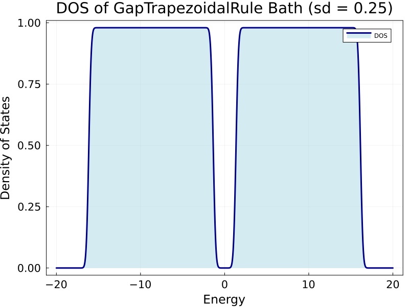
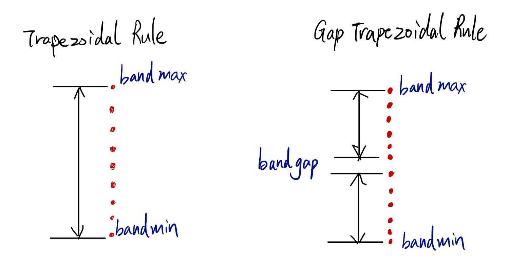
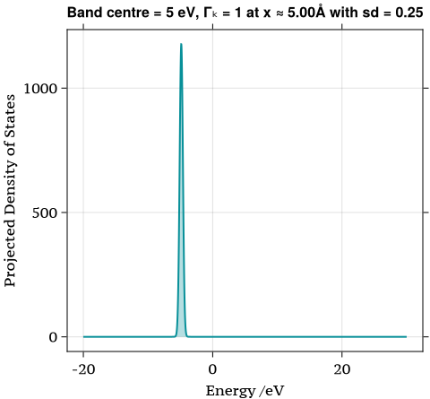
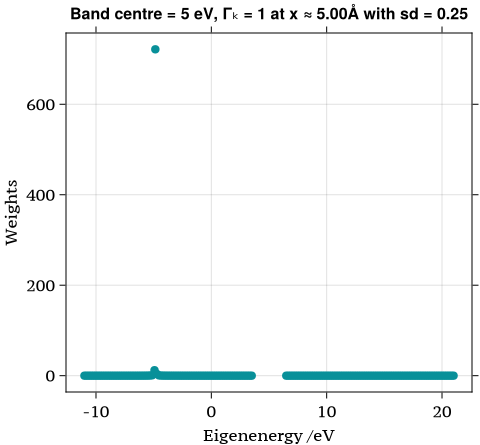
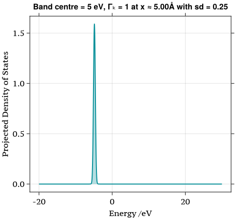
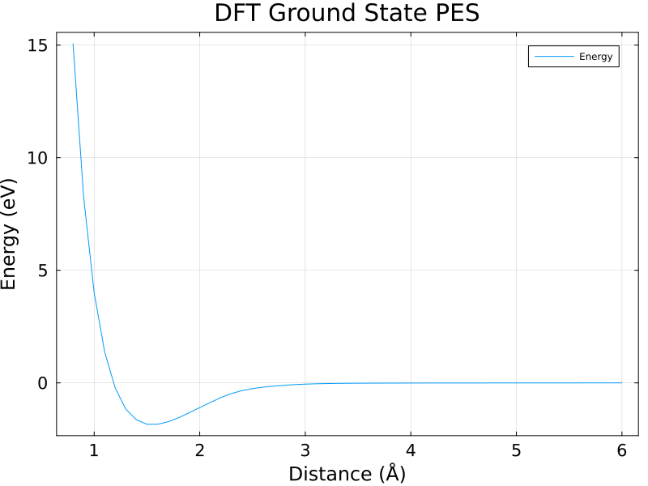

# Gapped Trapezoidal Rule

Hokseon implemented a `GapTrapezoidalRule` in [here](https://github.com/maurergroup/NQCModels.jl/tree/hokseson). 

The bath's DOS with 3eV bandgap is



Schematic of TrapezoidalRule:



The red dots are the discretized states of the bath. Obviously, when bandgap equal to zero, there are two states with value of the centre in our `GapTrapezoidalRule`. So, to make my function general, I let it directly do the `TrapezoidalRule` when bandgap = 0 eV instead.


# Rescaling Projected DOS

The main goal of the projected DOS is to find the how much contribution from the each eigenstates in the total system (bath + impurity) to the impurity's DOS. These weights can be calculated by projecting the eigenvectors matrix onto the absorbate basis
$$
[1,0,0,0,\cdots,0]^T
$$

More speifically, we should have
$$
\langle\phi_{\text{projected}}| H_{\text{el}}(x) = 
\begin{bmatrix}
1\\
0\\
0\\
\vdots\\
0
\end{bmatrix}^T
\cdot
\begin{bmatrix}
\textcolor{red}{h} & \textcolor{red}{A_{1}} & \textcolor{red}{A_{2}} & \cdots & \textcolor{red}{A_{n}} \\
A_{1} & \epsilon_1 & 0 & \cdots & 0 \\
A_{2} & 0 & \epsilon_2 & \cdots & 0 \\
\vdots & \vdots & \vdots & \ddots & \vdots \\
A_{n} & 0 & 0 & \cdots & \epsilon_n \\
\end{bmatrix} = \begin{bmatrix}
h\\
A_1\\
A_2\\
\vdots\\
A_n
\end{bmatrix}^T.
$$
By doing this step, we could compute the contribution from each eigenstates to the impurity states
$$
|\langle\phi_{\text{projected}}| \cdot [|\phi_{1}\rangle,|\phi_{2}\rangle,\cdots,|\phi_{n}\rangle]|^2 = [a_1^2,a_2^2,\cdots,a_n^2].
$$
The raw projected denisty of states is given as 



with area $\approx 740$. This number seem to be $\textcolor{red}{\text{robust}}$​​ even when I change the nstates, width of the band and standard deviation of Gaussian distributions. Just curious about this weird number.  

We plot this weights `ustrip(auconvert.(u"eV", evecs[200][1,:])).^2` against the eigenvalues:



The abnormal outliner represents the projected impurity's location in energy space. However, the scale of it is a bit way to big comparing with the rest of the weights.

```julia
julia> maximum(ustrip(auconvert.(u"eV", evecs[200][1,:])).^2)
721.4766814562648
```

Any ideas on this?

By dividing the area of the DOS, we easily obtain a more sensible PDOS. 




# DFT Ground State PES

Given data from Nils, we have




 [ErpenbeckThoss_PES_Fermi=2_GapGaussLegendre_Γₖ=1_nstates=500_gap=0.49_width=50.pdf](fig/24-May-2024/ErpenbeckThoss_PES_Fermi=2_GapGaussLegendre_Γₖ=1_nstates=500_gap=0.49_width=50.pdf) 

# Hokseon Concerns

### Actual Usage of `bathcoupling` in Wideband Assumption


Isn't it to make the DOS flat? Then, why do we have bathcoupling for Trapezoidal rule?


# After Meeting, Hokseon to-do-list

- Plot the DFT PES onto the adiabtic PES
- Integration up to Fermi level for Projected DOS not sure the meaning of it but what's Reini said tho.
