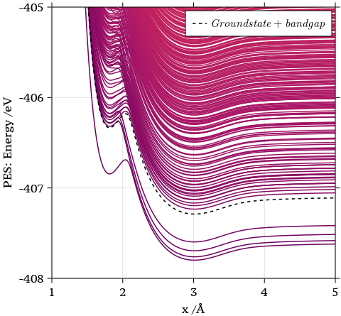

# Gapped Adiabatic PES 


This note records some findings and thoughts I have during the trip in Edinburgh. [Xuexun](https://louhokseson.github.io) remains all the copyright© of this script.

### The Logic of PES Evaluation

In James' implementation in IESH paper, PES can be is evaluated based on the  *Second Quantization configurational vector*. More details on Second Quantization can be access from [here](https://louhokseson.github.io/PDF/Second_Quantization.pdf).

For example, the ground state of the configuration is denoted as

$$
\begin{align}
|1,\cdots, 1 ,1 ,1,\textcolor{red}{0},0,0,0\cdots,0 \rangle \tag{Ground}
\end{align}
$$
In this case, our continuum's electrons are condensed in the valence band. It comes from the 1s are located on the left-hand side. **The red highlighted slot is quantum number for the impurity/molecule**. In our case, it stands for the number of electron on the impurity.



When impurity gets close enough to the surface, it generates the electronic excitiation in which electrons would hop onto higher states then increase the total energy of the system. So, the first excitation state comes from the ground state absorbing the least energy. The configuration is 
$$
\begin{align}
|1,\cdots,1, 1 ,0 ,\textcolor{red}{1},0,0,0,\cdots,0 \rangle \tag{$1^{\text{st}}$}
\end{align}
$$
The following $2^{\text{nd}}$, $3^{\text{rd}}$, $4^{\text{th}}$ and $5^{\text{th}}$ excited states' explicit forms are 
$$
\begin{align}

|1,\cdots,1, 0 ,1 ,\textcolor{red}{1},0,0,0,\cdots,0 \rangle \tag{$2^{\text{nd}}$}\\
|1,\cdots,0, 1 ,1 ,\textcolor{red}{1},0,0,0,\cdots,0 \rangle \tag{$3^{\text{rd}}$}\\
|1,\cdots,1, 1 ,0 ,\textcolor{red}{0},1,0,0,\cdots,0 \rangle \tag{$4^{\text{th}}$}\\
\end{align}
$$
The key implementation in Julia is given below

```julia
    config = vcat(ones(nelectrons), zeros(nelectrons+1))

    perms = multiset_permutations(config, nstates+1)
    configurations = []
    energies = []
    sortpoints = []
    """
        This setting makes sure that each PES has the same second quantization configuration
    """
    # loop over all the configurational permutations from groundstate to higher excited states
    for config in Iterators.take(perms, 20000)
        e = [sum(e[config .!= 0]) for e in eigs] # sum the eigenvalues of the occupied states at each grid point
        push!(energies, ustrip.(auconvert.(u"eV", e)))
        push!(sortpoints, e[end]) # record the adiabatic PES energy at the last grid point
        push!(configurations, config)
    end
		perm = sortperm(sortpoints)
    energies_raw = copy(energies[perm]) # sort the energies according to the adiabatic PES energy at the last grid point
    configurations = configurations[perm] # sort the configuration according to the adiabatic PES energy at the last grid point
```

- `e` stands for a array containing electronic Hamiltonian $H_{\text{e}}$ at each grid point $x$. 

- `sum(e[config .!= 0])` sums up the occupied states' eigenvalues of a particular configurational vector.

- `perm = sortperm(sortpoints)` sorts the `e` according to enegry of the end point (farthest position to the surface). In our case, the energy at $x = 5\text{\AA}$​.

  

With the discussion above, each purple PES correpsonds to a unique configuration. By caculating these configurations' total energy at every grid point $x$, we obtain these curves above.

### Xuexun's Analysis

From the figure above, it is obvious to see that $4^{\text{th}}$ excited PES forms a bandgap with the groundstate PES. You could see that it almost perfectly matches the dashedline. Also, in the configurational perspective, a electron jumps from the higest valence state to the lowest conduction state which should be the bandgap we parameterised. So far, everything makes sense in both physical and mathematical ways.

What's wrong with these excited states in between then? Through the configurational vector, $1^{\text{st}}$​​ excited state is created by electron hopping onto the impurity which is assumed to be located at the Fermi level (within the bandgap). This configuration of first excited state should be universal to any surface as long as the impurity state is in between the highest occupied state and lowest unoccupied state.

However, it takes two more steps for the electron to hop onto the lowest conduction state which is ($4^{\text{th}}$). This happens due to the fact that the existence of the band gap. And these two extra steps are ($2^{\text{nd}}$) and ($3^\text{rd}$​). The number of extra number might vary according to the band gap. Because the mechanism here simply is we have to go through all possible permutations while only occupying the impurity state above the highest valence state before a single electron occupies the lowest conduction state from ground state. I consider these extra steps as **accumulation states** just because the electron needs to congest energy for overcoming the gap.

These accumulations states and first excited state share a common behaviour which in Cantonese called '黐線'. I would say this is a perfect description because it literally means lines stick together and verbally refers to something weird. These three states initially stick with ($4^{\text{th}}$) and suddently diverge at $x \approx 2 \text{\AA}$ to kiss the groundstate. 

**Facts to Hypotheses**

- Accumulation states and the first excited state are having impurity charged (Obvious by checking the configurational vectors). And they stick to ($4^{\text{th}}$) where $x < 2 \text{\AA}$. $\Rightarrow$ $U_1$ and $U_0$ behave more and less the same

### Xuexun's Concerns

I spent so much time explainning how the code works and even did some creative analysis above. I just realized that I was assuming the eigenenergy of the impurity is **always** between valence band and conduction band. In other words, my assumption states that $51^{\text{st}}$​​ entry (red highlighted) in the configurational vector is always the impurity's occupation. However, in order to be completely confident and responsibe to what I was bullshitting so far. I wanted to check the eigenvalues for the impurity from the electronic Hamiltonian. 

The eigenvalue evaluation:

````julia
eigs = eigvals.(potential.(model, matrix_x))
````

where the electronic Hamiltonian is caculated by 

```julia
potential.(model, matrix_x)
```

which is 
$$
\begin{align}
    H_{\text{el}}(x) = 
\begin{pmatrix}
h & A_{1} & A_{2} & \cdots & A_{n} \\
A_{1} & \epsilon_1 & 0 & \cdots & 0 \\
A_{2} & 0 & \epsilon_2 & \cdots & 0 \\
\vdots & \vdots & \vdots & \ddots & \vdots \\
A_{n} & 0 & 0 & \cdots & \epsilon_n \\
\end{pmatrix}. \label{eq:Hamiltonian-matrix-NA}
\end{align}
$$


With the representation above, just to have a sanity check whether
$$
\epsilon_{51} - \epsilon_{50} \approx \text{bandgap}.
$$
The gap from the matrix $H_{\text{el}}$:

```julia
diag(potential.(model,matrix_x)[1])[52]-diag(potential.(model,matrix_x)[1])[51]
0.22103749835249775
```

The gap we set:

```julia
austrip(6 * u"eV")
0.22049593305311155
```

 This should suggest that our matrix's set up is correct.

Now, we may turn our focus on the calculated eigenvalues. In each grid point, we should have 101 eigenvalue simply because of having a 101 by 101 matrix. And `eigvals()` lists the eigenvalues in a increasing way (low to high). So, I guess the if the impuriy's state is located between the valence and conduction band, it should be called by 

```julia
eigs[end][51]
```

However the result is 

```julia
# assumed as the impurity state
eigs[end][51]
-0.11051856649998487
# conduction band lowest state
eigs[end][52]
0.11051879233864188
# valence band highest state
eigs[end][50]
-0.1116731218485293
# \epsilon_{50}
diag(potential.(model,matrix_x)[end])[51]
-0.11051874917624888
# h(x)
diag(potential.(model,matrix_x)[end])[1]
-0.17906740065508425
```

If the assumption is true, $51^{\text{st}}$ entry of `eigs` should be the state of impurity. In this case, impurity approximately becomes one of the states in valence band. It matches the fact of '黐線' phenomena in the first figure. Those accumulation states stick to the ground state because the impurity acts like a valence state. However, it valids only when `eigs[end][51]` stands for the impurity.  Because it looks suspicious that $h(x) = -0.179067$​ and we shouldn't have much hybridisation because impurity is far from the surface. 

**Therefore, here raises a big question mark to me. Is it okay to use this configurational vector to denote the index of the continuum and impurity (h(x)) states. Because apparently index 51 doesn't always imply the impurity h(x).**


