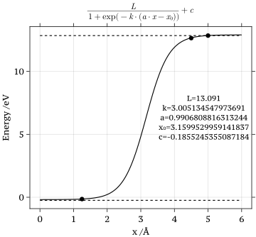

# Design of $h(x)$

**Why does Hokseon work on this?**

On Friday $31^{\text{st}}$ May 2024, Reini and Hokseon decided to shift our attention back to the H/$\text{H}^{-}$ scattering on **Germanium** 锗 from H/$\text{H}^{+}$. In this sense, the impurity state $h(x)= U_1 - U_0$ will begin in the conduction band when $x=5\text{\AA}$. It goes down to the band gap and embrace into the valence band. The adiabatic PESs' gap would close when the impurity $h(x)$​ hits the valence band. Because the valence band obtains an extra state but remains the same total number of electrons.

Images courtesy of **Sara Oregioni**, 2024.


Here above, we have some basic constraints for the $h(x)$ such as *electronic affinity* and *ionisation energy* of the H atom.

In the end, the adiabatic PES should look like 


Image courtesy of **Sara Oregioni**, 2024

### Sigmoid Functions

A **sigmoid function** is any [mathematical function](https://en.wikipedia.org/wiki/Mathematical_function) whose [graph](https://en.wikipedia.org/wiki/Graph_of_a_function) has a characteristic S-shaped or **sigmoid curve**.

**Logistic Function**



Black dots' coordinates

```julia
ϵ = 0.2
data_points = [(5,ionization_energy - electron_affinity),
               (4.5, ionization_energy - electron_affinity - ϵ),
               (1.25, -bandgap/2 + ϵ)]
```

**What to do next**

- Integrate this sigmoid function into NQCModels.jl
- Use sigmoid in Hokseon model for plotting the Adiabatic PES


# Weekly Results

### Okay Logistic Function Fit for $h(x)$


The fitting data are given as

```julia
data_points = [(5,ionization_energy - electron_affinity),
               (4.5, ionization_energy - electron_affinity - ϵ),
               (1.25, -bandgap/2 + ϵ),
               (1.144, -bandgap/2)]
```

The upper dashed line stands for the energy:
$$
\text{ionization energy} - \text{electron affinity}= 13.6\text{eV} - 0.754\text{eV}
$$

### Alright Morse Potential Fit as $U_0$

It works when $\Gamma_k$​​ is relatively small (adiabiatic case?) 

The morse potential is fitted from the DFT data of restatom.


Given $h(x)$ and $U_0$, we should have $U_1$, I call it Hokseon model


### Location That The Gap Should Close


Basically, I fitted a polynomial and solve the solution at $\text{Energy} = 0.49\text{eV}$. So ideally, our adiabatic PESs should have a closing point at 1.144 $\text{\AA}$.

### Alright Adiabatic PESs

Generally the hybridisation is weaker, the fitted parameters work better.


**Zoom In Versions**

[$\Gamma_k = 0.02$](https://louhokseson.github.io/Typora/fig/7-Jun-2024/DFT_data=restatom_Dₑ=1.76_a=1.92_bandgap=0.49_c=-1.71_centre=0.0_discretisation=GapGaussLegendre_gamma=0.02_molecule_charged=false_nstates=500_width=50_x̃=2.7_x₀=1.53.pdf)

[$\Gamma_k = 0.1$](https://louhokseson.github.io/Typora/fig/7-Jun-2024/DFT_data=restatom_Dₑ=1.76_a=1.92_bandgap=0.49_c=-1.71_centre=0.0_discretisation=GapGaussLegendre_gamma=0.1_molecule_charged=false_nstates=500_width=50_x̃=2.7_x₀=1.53.pdf)

[$\Gamma_k = 0.5$](https://louhokseson.github.io/Typora/fig/7-Jun-2024/DFT_data=restatom_Dₑ=1.76_a=1.92_bandgap=0.49_c=-1.71_centre=0.0_discretisation=GapGaussLegendre_gamma=0.5_molecule_charged=false_nstates=500_width=50_x̃=2.7_x₀=1.53.pdf)

[$\Gamma_k = 1.0$](https://louhokseson.github.io/Typora/fig/7-Jun-2024/DFT_data=restatom_Dₑ=1.76_a=1.92_bandgap=0.49_c=-1.71_centre=0.0_discretisation=GapGaussLegendre_gamma=1_molecule_charged=false_nstates=500_width=50_x̃=2.7_x₀=1.53.pdf)

### Hokseon's Thoughts

- When we have noticeable hybridisation, we shouldn't rely on the parameters from the Least Square fitting. We probably need to tune the parameters manually.
- Still need to think about the crossing point problem. Because the gap closes later than 1.144 $\text{\AA}$.