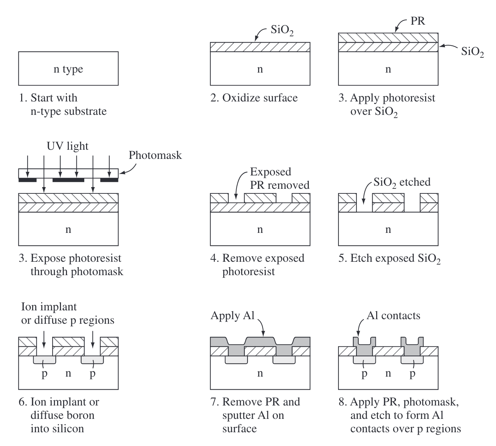

# Foundational Learnings on Semiconductor

Book: [**Semiconductor Physics and Devices** *Basic Principles*](https://www.optima.ufam.edu.br/SemPhys/Downloads/Neamen.pdf) by **Donald A. Neamen**

## Useage of Semiconductor

- Mainly used for fabricating *integrated circuits* (集成电路)

## Fabrication of Intergrated Circuits Steps

- Thermal Oxidation
- Photomask(光罩) and Photolithography(光刻)
- Etching
- Doping (Impurity atoms are introduced into the silicon material to increase conductivity) relating to atom scattering on semiconductor surface  (Ion implant (Firing atom onto the surface)/ Diffusion (control the temparture))
- Metallization, Bonding, and Packaging

## Simplified Fabrication of a P-N Junction

the details of these steps are explained from the prolouge of the [**Semiconductor Physics and Devices** *Basic Principles*](https://www.optima.ufam.edu.br/SemPhys/Downloads/Neamen.pdf).

## Two Major Types of Semiconductor

Two general classifications of semiconductors are the elemental semiconductor materials

Si and Ge are purely elemental semiconductors material.

## Imperfections in Solids

There are two types of imperfection in solids. This imperfection would affect the electrical properties of the material.

Hokseon's question: Would these imperfections affect the DOS of the continuum in our NAH set up??

### Lattice Vibration (temperature related)

One type of imperfection that all crystals have in common is atomic thermal vibration. A perfect single crystal contains atoms at particular lattice sites, the atoms separated from each other by a distance we have assumed to be constant.

The atoms in a crystal, however, have a certain *thermal energy*, which is a function of temperature. The thermal energy causes the atoms to vibrate in a random manner about an equilibrium lattice point. This random thermal motion causes the distance between atoms to randomly fluctuate, slightly disrupting the perfect geometric arrangement of atoms.

### Point Defect

In an ideal single-crystal lattice, the atoms are arranged in a perfect periodic arrangement. However, in a real crystal, an atom may be missing from a particular lattice site. This defect is referred to as a *vacancy*; In another situation, an atom may be located between lattice sites (多出一个位置). This defect is referred to as an *interstitial*.

### Line Defect

Comparing to point defect,  more complex defects may occur in forming single-crystal materials,. A line defect, for example, occurs when an entire row of atoms is missing from its normal lattice site. This defect is referred to as a *line dislocation*.

## Impurities in Solids

Foregin atoms, or impurity atoms, may be present in a crystal lattice. Impurity atoms may be located at normal lattice sites, in which case they are called *substitutional* impurities. Impurity atoms may also be located between normal sites, in which case they are called *interstitial* impurities.

### Doping

The technique of adding impurity atoms to a semiconductor material in order to change its conductivity is called doping. There are two general methods of doping: *impurity diffusion* and *ion implantation*.

# Introduction to the Quantum Theory of Solids

## The Energy Band and the Bond Model

Figure 3.12 shows a two-dimensional representation of the covalent bonding in a single-crystal silicon lattice. This figure represents silicon at  $T = 0 \text{ K}$ in which each silicon atom is surrounded by eight valence electrons that are in their lowest energy state and are directly involved in the covalent bonding. All of the valence electrons schematically shown in Figure 3.12 are in the valence band. The upper energy band, the conduction band, is completely empty at $T = 0 \text{ K}$​.

As the temperature increases above 0 K, a few valence band electrons may gain enough thermal energy to break the covalent bond and jump into the conduction band. Figure 3.13a shows a two-dimensional representation of this bond-breaking effect and Figure 3.13b, a simple line representation of the energy-band model, shows the same effect. 键断裂 电子自由了

Hokseon's question: Isn't it similar to electron-hole pair excitation?

## Concept of the Hole

Figure 3.13a, a positively charged “empty state” was created when a valence electron was elevated into the conduction band. For $T > 0 \text{ K}$, all valence electrons may gain thermal energy; if a valence electron gains a small amount of thermal energy, it may hop into the empty state. The movement of a valence electron into the empty state is equivalent to the movement of the positively charged empty state itself.

## Metals, Insulators, and Semiconductors

We can qualitatively begin to understand some basic differences in electrical characteristics caused by variations in band structure by considering some simplified energy bands.

### Insulators Figure3.19

Figure 3.19a shows an allowed energy band that is completely empty of electrons. If an electric field is applied, there are no particles to move, so there will be no current. Figure 3.19b shows another allowed energy band whose energy states are completely full of electrons. **A material that has energy bands either completely empty or completely full is an insulator.** Figure 3.19c shows a simplified energy-band diagram of an insulator. The bandgap energy $E_g$​​ of an insulator is usually on the order of 3.5 to 6 eV or larger, so that at room temperature, there are essentially no electrons in the conduction band and the valence band remains completely full. There are very few thermally generated electrons and holes in an insulator.

### Semiconductors Figure3.20

Figure 3.20a shows an energy band with relatively few electrons near the bottom of the band. Now, if an electric field is applied, the electrons can gain energy, move to higher energy states, and move through the crystal. The net flow of charge is a current. Figure 3.20b shows an allowed energy band that is almost full of electrons, which means that we can consider the holes in this band. If an electric field is applied, the holes can move and give rise to a current. Figure 3.20c shows the simplified energy-band diagram for this case. The bandgap energy may be on the order of 1 eV.

(当electrons去占有holes, valence band 和 conduction band 都可以导电)

### Metal Figure3.21

The characteristics of a metal include a very low resistivity. **The energy-band diagram for a metal may be in one of two forms.** Figure 3.21a shows the case of a partially full band in which there are many electrons available for conduction, so that the material can exhibit a large electrical conductivity. Figure 3.21b shows another possible energy-band diagram of a metal. The band splitting into allowed and forbidden energy bands is a complex phenomenon, and Figure 3.21b shows a case in which the conduction and valence bands overlap at the equilibrium interatomic distance. As in the case shown in Figure 3.21a, there are large numbers of electrons as well as large numbers of empty energy states into which the electrons can move, so this material can also exhibit a very high electrical conductivity.

Hokseon's question: If we have energy bands didn't have a gap but also no overlapping and full occupation in valence band, does it mean this material is still a insulator?