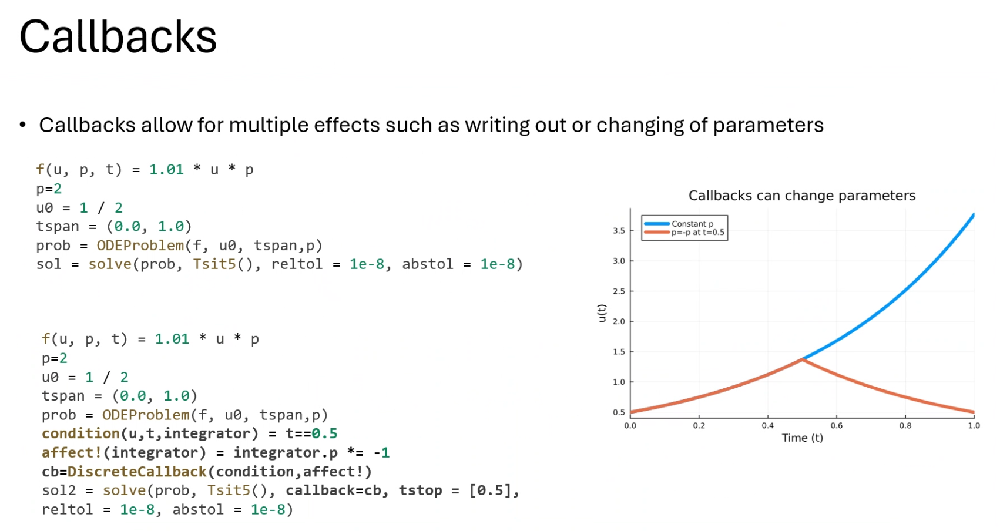

# Thu Jun 13 Julia Group Seminar

Speaker: Henry Snowden

### Benchmarking

Package `BenchmarkTools.jl`

### Multithreading

`Threads.nthreads()`

### GPU Computing

Nvidia/AMD

Turn scalars into vector

### Struct Usage

## SciML

### DiffEq

Callbacks

Symbolics (speed up the function evaluation)

ModelingTookit (need to check)

## Nonadiabatic MD NQCD

Speakers: Alex Spears

[Talk's link](https://alexsp32.github.io/NQCDynamics.jl-tech-presentation/#/the-maths-behind-md-solving-differential-equations)

