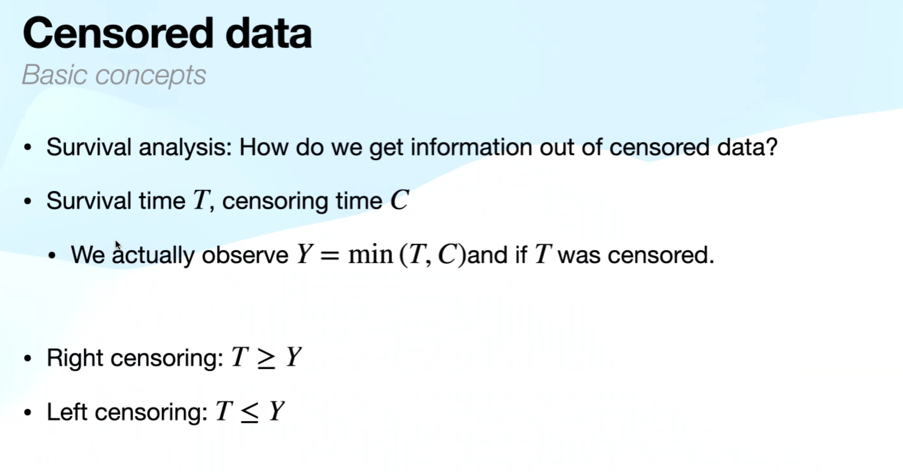
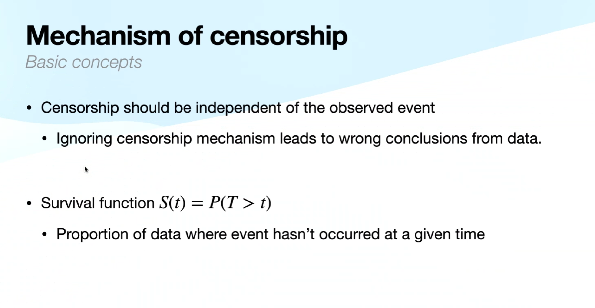
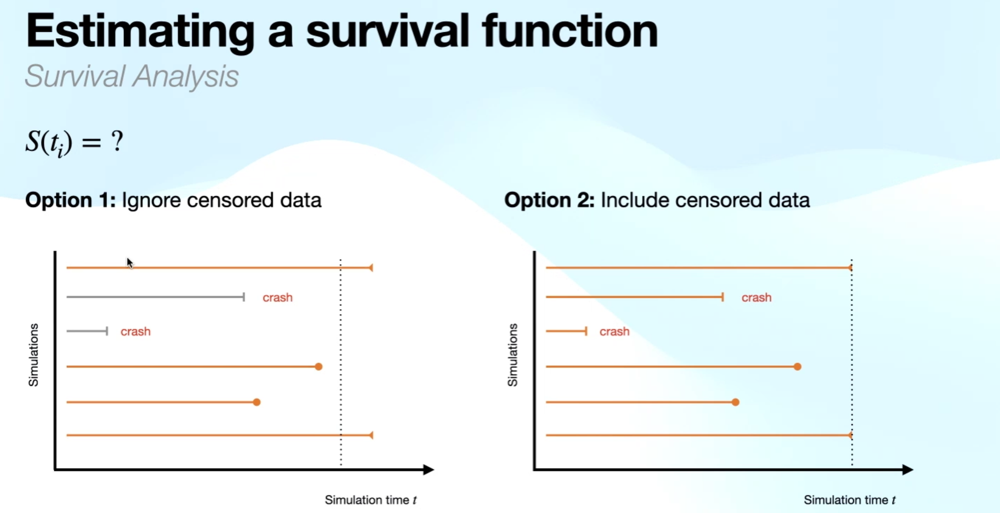
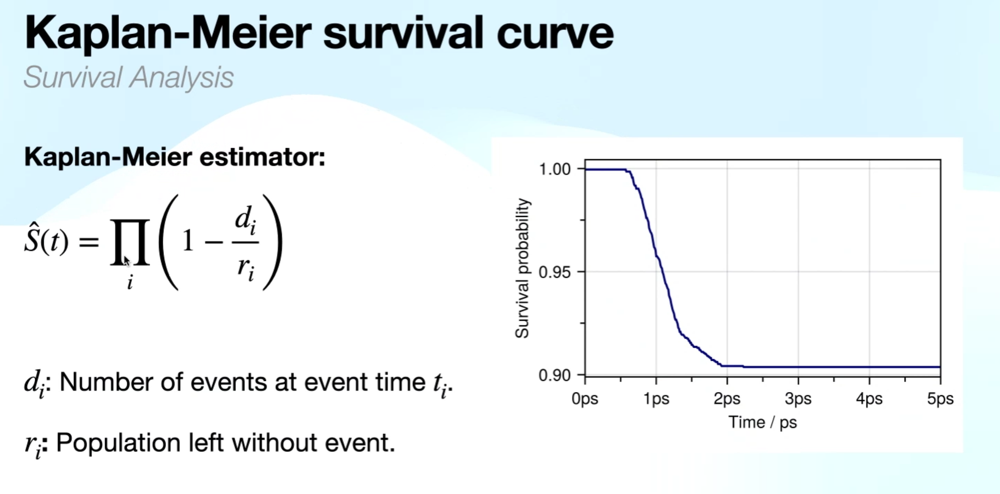
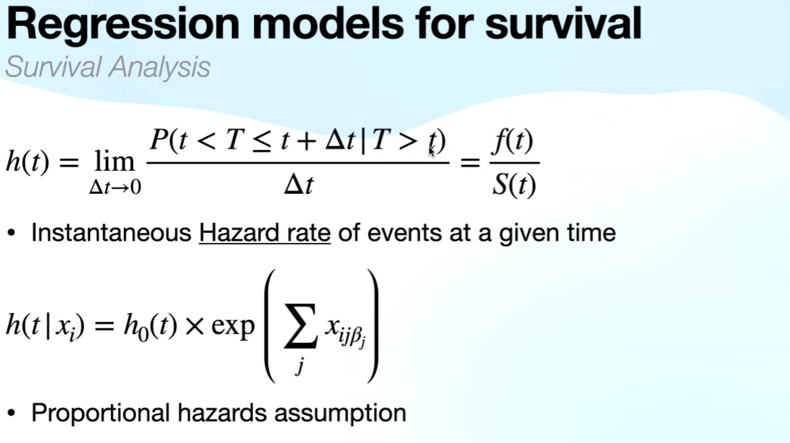
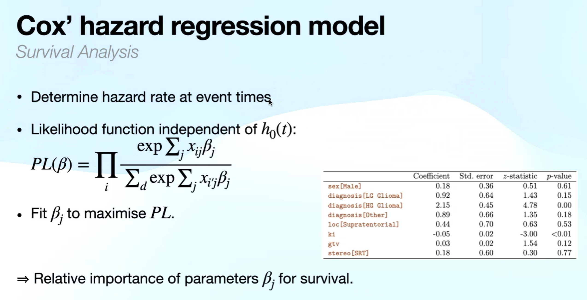

# Maurer Machine Learning Group Seminar 3 June 2024

Speaker: Alex Spears

Topic: Survival Analysis and Censored Data

Basically, it is a statistical concept about *Censorship* 审查

Censored data here is crash (the grey data).

