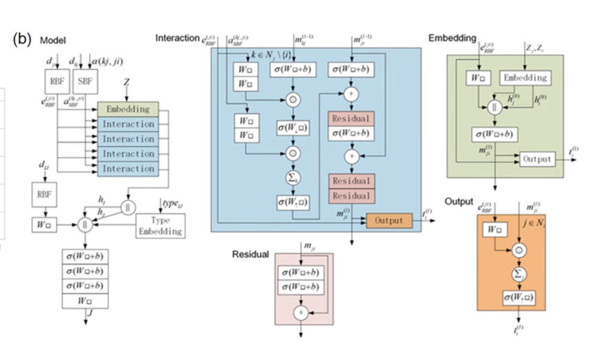

# 9 May 2024 [Chen Qian](https://warwick.ac.uk/fac/sci/chemistry/research/maurer/maurergroup/people/chenqian/) in Warwick

He presented his previous work in Zhejie University as a PhD and CityU as a postdoc in Maurer's group meeting. His talk was divided into two parts, DFT and deep learning.

### DFT Part (lost)

AA Bilayer semiconductor

- reduced friction on dodecagonal quasicrystals.
- MD -> Tomlinson model

### Network Design of GNN (graph neural network)

### Multi-fidelity Network

**Terminologies**

- RBF Kernels: [Radial Basis Function](https://en.wikipedia.org/wiki/Radial_basis_function_kernel) just a function compute two vectors' distance (norm function)
- Softplus : Smooth approximation of ReLu (Softmax) Activation function.
- Matformer: https://paulguerrero.net/matformer/

### Diffusion Model

**General idea of the diffusion model**

###  Generative model for 2D and 3D Crystals (page 15)

He mentioned using Langevin dynamics to sample. 样本概率分布。

Adaptor: Interesting to check!

Generate the stuff with conditions or without conditions. 

### Irreducible Representation

