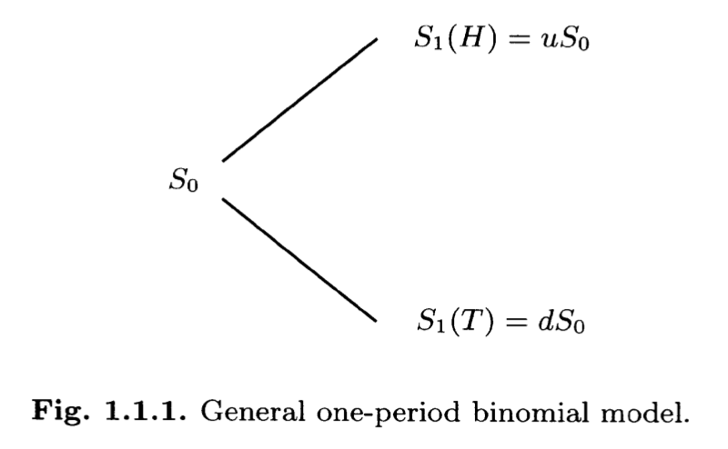
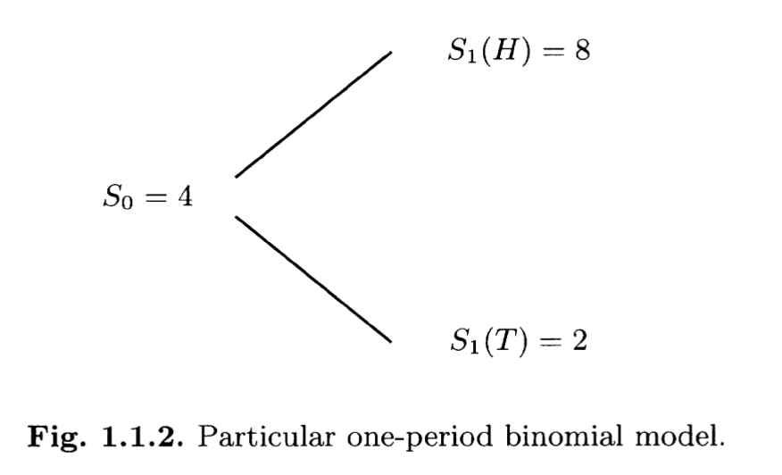

# Sun May 12 2024

## Binomial Model and Its No-Arbitrage Condition

We start with binomial asset-pricing model to understand **arbitrage pricing theory**. 

Definition of *arbitrage (套利)*: 

*A trading strategy that begins with no money, has zero probability of losing money and has a positive probability of making money.* 

### One Period Binomial Model

At time zero, we have a stock whose price per share we denote by $S_0$, a **positive** quantity known at time zero. At time one, the price per share of this stock will be one of two positive values, which we denote $S_1(H)$ and $S_1(T)$, the $H$ and $T$ standing for the *head* and *tail*, respectively. This is called binomial model that means the probability of head, which we call $p$, is positive, and the probability of tail, which is $q = 1- p$, is also positive. We introduce two positive values 
$$
u = \frac{S_1(H)}{S_0}, \quad d = \frac{S_1(T)}{S_0}. 
$$
We refer $u$ as *up* factor and $d$ as *down* factor. Intuitively,  we should have 
$$
0< d<1<u
$$
in the reality.

**Interest rate** $r$ need to be introduced for arbitrage. One dollar invested in money market at time zero will yield $1+r$ dollars at time one. Conversely, one dollar borrowed from the money market at time zero will result in a debt of $1+r$​ at time one.

In the one-period binomial model, to rule out (排除) arbitrage we must assume
$$
0<d< 1+r<u.
$$
 If $d \geq 1 + r$, one could begin with zero wealth and at time zero borrow from the money market in order to buy stock. Even in the worst case of a tail on the coin toss, the stock at time one will be worth enough to pay off the money market debt and has a positive probability of being worth strictly more since $u > d> 1+r$. Within this condition, we can see the arbitrage.

 If $u\leq 1+r$, one could sell the stock short and invest the proceeds in the money market. Even in the best case for the stock, the cost of replacing it at time one will be less than or equal to the value of the money market investment and since $d<u \leq 1+r$, there is a positive probability that cost of replacing the stock will be strictily less than the value of the money market investment. This again provides an arbitrage. (用卖左这个model的钱，去放数)

With the discussion above in one-period binomial model, there is to be no arbitrage in the market with stock and the money market account , then we must have (3). The converse of this is also true. If (3) holds, there is no arbitrage.

###  European Call Option

A option that confers on its owner the right but not the obligation to buy one share of the stock at time one for the *strike price* $K$. The interesting case , which we shall assume here, is that 
$$
S_1(T) < K <S_1(H).
$$
If we get a tail on the toss, the option expires worthless. Because apparently nobody would exercise the option with $K$ where you could get the stock at price $S_1(T)$ from the stock market. However, if we get a head on the coin toss, the option can be *exercised* and yields a profit of $S_1(H) - K$. Now, we summarise the yields of this option in maths:
$$
(S_1(x)-K)^{+} \quad \text{where } x \in\{H,T\}
$$
Here, the notation $(\cdots)^+$ stands for 
$$
(y)^+ = \max\{y,0\}.
$$
Here we follow the usual custom in probability of omitting the argument of the random variable $S_1$. The fundamental question of option pricing is **how much the option is worth at time zero** before we know whether the coin toss results in hcad or tail.

### Trading the Option with Arbitrage and No-Arbitrage

For the particular one-period model, let $S(0)=4$, $u=2$,$d=\frac{1}{2}$, and $r = \frac{1}{4}$. Then $S_{1}(H)=8$ and $S_1(T)=2$. Suppose the strike price of the European call option is $K=5$. Suppose further that we begin with an initial wealth $X_0 = 1.20$ and buy $\Delta_0 =\frac{1}{2}$​ shares of the stock at time zero.

**What is the value of opttion?**

Having the option mean that you could use 5 to get a the stock having the value $S_1(H)=8$. Then, you use less money to obtain more valuable asset. That's easiest way to see the value. But people in reality work in a smarter way, we do not need to really have to buy the asset $S_0=4$ at time zero. Instead, we could just use a smaller amount of money to play this game by focusing on the yields of the option. In this sense, the actual value of the asset does not matter in this option any more. We just value the yields. 

In this particular case, if the coin at time one is Head, the option seller should pay the option holder 3. It comes from 
$$
(S_1(H)-K)^{+} = (8-5)^{+} = 3.
$$
If the coin shows tail at time one, the option holder would not exercise the option. So no money from the option seller need to be sent to holder.
$$
(S_1(T)-K)^{+} = (2-5)^{+} = 0.
$$
In order to play this game, it need option buyer to pay a mount of money to the option seller to form this game and be the option holder. Then, how much should be this option?

Since stock costs 4 per share at time zero, we must use our initial wealth $X_0=1.20$ and borrow an additional $0.80$ (a debt of 0.80 to the money market). At time one, our cash position will be $(1+r)(X_0-\Delta_0S_0) = -1$ (We will have a debt of 1 to the money market). On the other hand, at time one we will have stock valued at either $\frac{1}{2}S_1(H) = 4$ or $\frac{1}{2}S_1(T)=1$. In particular, if the coin toss results in a head, the value of our portfolio of stock and money account at time one will be
$$
X_1(H) = \frac{1}{2}S_1(H) + (1+r)(X_0-\Delta_0S_0) =3
$$
if the coin toss results in a tail, the value of our portfolio of stock and money account 